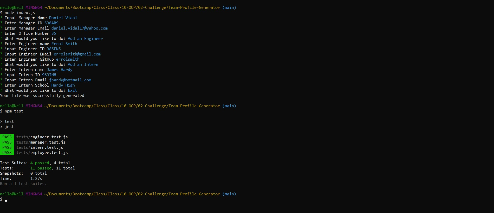
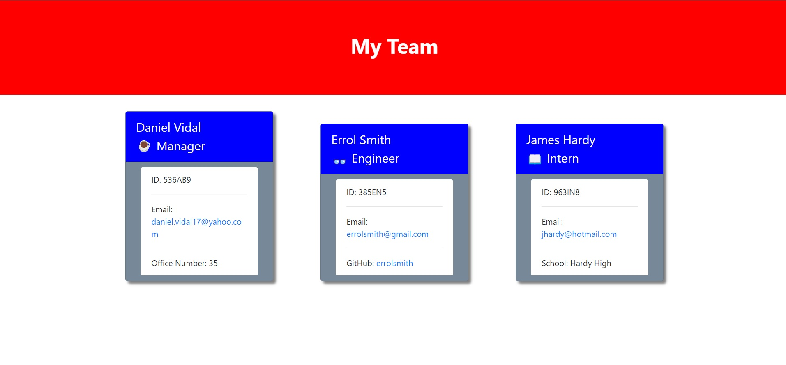

# Team-Profile-Generator

## Description
This is an Command Line application to allow users to create a summary Team Profile.

Link to video on how to use: [Video Link](https://drive.google.com/file/d/1I-KyCkkpXs6ZIhMRFTb6KIoDd5s_u5Vz/view)

## Screenshots

## Installation

In order to install this application all you need to do is extract it to your desired location. In order to run this program you will need to have node installed on your computer.

Node can be found [here](https://nodejs.org/en/download/)

## Usage

To use this application you must first open the folder in command line / terminal. 
Once done you can go ahead and execute the line "node run index.js". 
Answer the questions that appear in the cmd/terminal and once done, you may select to exit the program and then the file will be generated.

## License 
MIT License

Copyright (c) 2022 Daniel Vidal

Permission is hereby granted, free of charge, to any person obtaining a copy
of this software and associated documentation files (the "Software"), to deal
in the Software without restriction, including without limitation the rights
to use, copy, modify, merge, publish, distribute, sublicense, and/or sell
copies of the Software, and to permit persons to whom the Software is
furnished to do so, subject to the following conditions:

The above copyright notice and this permission notice shall be included in all
copies or substantial portions of the Software.

THE SOFTWARE IS PROVIDED "AS IS", WITHOUT WARRANTY OF ANY KIND, EXPRESS OR
IMPLIED, INCLUDING BUT NOT LIMITED TO THE WARRANTIES OF MERCHANTABILITY,
FITNESS FOR A PARTICULAR PURPOSE AND NONINFRINGEMENT. IN NO EVENT SHALL THE
AUTHORS OR COPYRIGHT HOLDERS BE LIABLE FOR ANY CLAIM, DAMAGES OR OTHER
LIABILITY, WHETHER IN AN ACTION OF CONTRACT, TORT OR OTHERWISE, ARISING FROM,
OUT OF OR IN CONNECTION WITH THE SOFTWARE OR THE USE OR OTHER DEALINGS IN THE
SOFTWARE.
